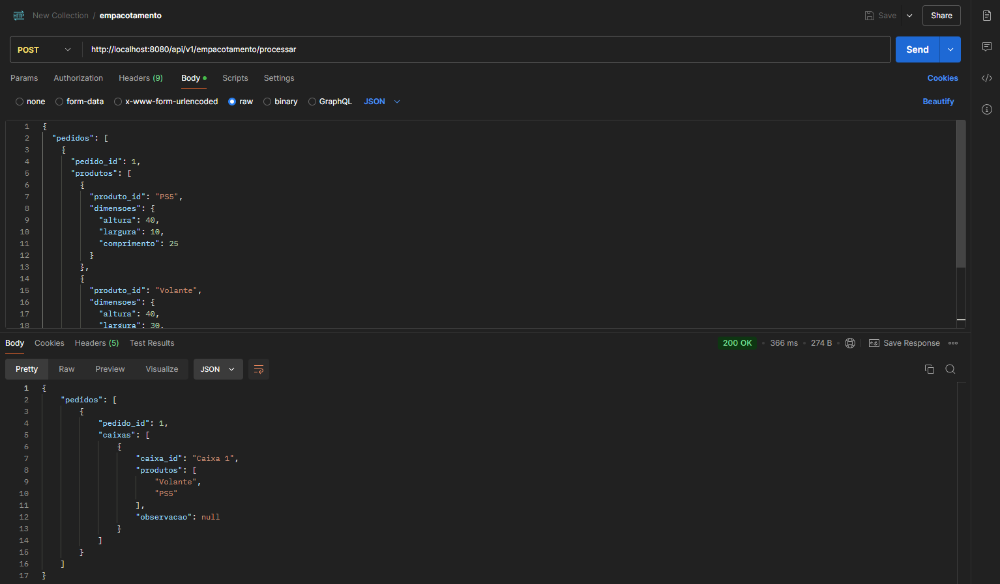

<h1 align="center">
  API em Java com Spring Boot para Empacotamento de Pedidos
</h1>

API para consumo de dados de pedidos com produtos e suas dimensões, que processa a melhor forma de embalar esses produtos em caixas de papelão, otimizando o uso do espaço e minimizando a quantidade de caixas usadas.

---

## Resumo do Desafio

Seu Manoel tem uma loja de jogos online e deseja automatizar o processo de embalagem dos pedidos. A API deve receber, em JSON, uma lista de pedidos contendo produtos com suas dimensões (altura, largura e comprimento em cm). O sistema precisa determinar para cada pedido qual o tamanho das caixas de papelão que devem ser usadas, quais produtos vão em cada caixa, podendo usar uma ou mais caixas para um pedido.

---

## Regras de Negócio

- Disponíveis 3 tamanhos fixos de caixas de papelão:
  - Caixa 1: 30 x 40 x 80 cm
  - Caixa 2: 80 x 50 x 40 cm
  - Caixa 3: 50 x 80 x 60 cm

- Cada pedido pode conter vários produtos.
- Os produtos devem ser embalados de forma otimizada, minimizando o número de caixas utilizadas.
- Produtos são alocados em caixas de acordo com as dimensões e volume disponível.
- A API recebe uma lista de pedidos e retorna para cada pedido:
  - As caixas utilizadas
  - Os produtos que vão em cada caixa

---

## Tecnologias

- [Spring Boot](https://spring.io/projects/spring-boot)
- [Spring Dev Tools](https://spring.io/tools)
- [Spring Data JPA](https://docs.spring.io/spring-data/jpa/reference/html/#jpa.query-methods)
- [H2 Database](https://www.h2database.com/html/main.html)
- [Docker](https://www.docker.com/)
- [Swagger](https://swagger.io/tools/swagger-ui/)


## Práticas adotadas

- Princípios SOLID
- Uso de DTOs para comunicação na API
- Injeção de Dependências (DI)
- Auditoria sobre criação e atualização das entidades
- Validação de dados com Bean Validation
- Tratamento centralizado de exceções

---

## Como Executar

### Usando Docker

```bash

docker-compose up --build

```

### Localmente

-   Clonar repositório git
-   Construir o projeto:

```
./mvnw clean package
```

-   Executar:

```
mvn clean package

```

A API poderá ser acessada em [localhost:8080](http://localhost:8080).

-   Clonar repositório git
-   Construir o projeto:

## API Endpoints


```
http POST :8080//api/v1/empacotamento/processar

HTTP/1.1 200 OK
Content-Length: 129
Content-Type: application/json


{
  "pedidos": [
    {
      "pedido_id": 1,
      "produtos": [
        {
          "produto_id": "PS5",
          "dimensoes": {
            "altura": 40,
            "largura": 10,
            "comprimento": 25
          }
        },
        {
          "produto_id": "Volante",
          "dimensoes": {
            "altura": 40,
            "largura": 30,
            "comprimento": 30
          }
        }
      ]
    }
  ]
}
```

## Output do desafio no Postman

